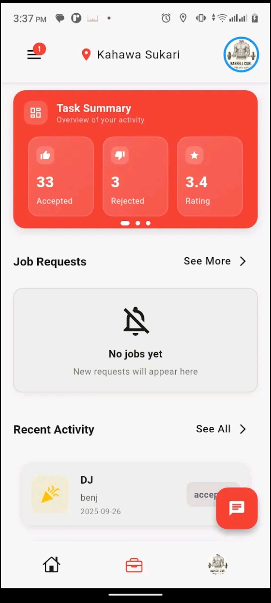
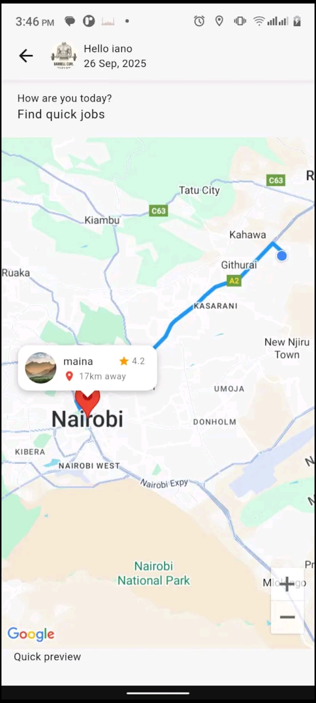

# Talent Finder

On-demand skilled services marketplace built with Flutter.

## Overview

Talent Finder connects users with nearby skilled workers such as plumbers, electricians, technicians, and other casual service providers. The platform supports real-time service requests, location-based matching, and structured workflows from booking to task completion.

This repository contains the mobile application.

## Key Focus Areas

- Location-based matching and worker discovery
- Real-time service request and acceptance flows
- Booking, task tracking, and status updates
- Reliable networking under poor or unstable connectivity
- Clear, predictable user journeys for both clients and workers

## Screenshots

  
  
  
  

## Tech Stack

- Flutter (Dart)
- Location services
- REST APIs
- Real-time communication services

## Architecture Notes

The application is designed around explicit state transitions for service requests to avoid ambiguous or conflicting states. Network failures, retries, and partial updates are handled deliberately to prevent data inconsistencies and degraded user experience.

The structure favors clarity and resilience over abstractions.

## Status

Production-ready  
(Some services omitted)

## Notes

This project is built with real-world usage in mind, where network reliability, device quality, and user behavior cannot be assumed to be ideal.
